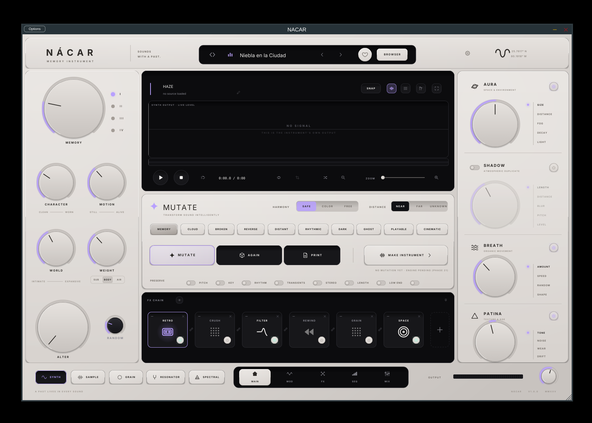

# NÁCAR

**MEMORY INSTRUMENT**

> Sounds with a past.

A hybrid software instrument, an intelligent sample transformation environment,
and a musically constrained mutation engine — one product, one identity.

NÁCAR can create a sound, give it an imaginary history, break that history
apart, reconstruct it musically, and turn the result into another instrument.

---

## What it is

```
GENERATE → REMEMBER → MOVE → BREAK → REARRANGE → PLACE → WEIGHT → BECOME SOMETHING ELSE
```

- **SYNTH** — three synthesis characters over one core: MIRAGE (digital
  dimension), HAZE (mysterious polyphonic atmosphere), MASS (physical weight)
- **SAMPLE · GRAIN · RESONATOR · SPECTRAL** — four further source engines
- **MEMORY** — four generations of recorded history, from subtle character to
  deep artefact
- **MUTATE** — musically constrained generative sound design, governed by two
  independent axes: HARMONY (how far it may stray harmonically) and DISTANCE
  (how far it may stray timbrally)
- **RETRO · CRUSH · FILTER · REWIND · GRAIN · SPACE** — a reorderable chain
  where the displayed order is the DSP order
- **AURA · SHADOW · BREATH · PATINA** — atmosphere, afterimage, organic
  movement, age

## What it looks like



More in [Docs/screenshots](Docs/screenshots).

## Repository layout

```
Source/Audio/        every engine: sources, memory, modulation, FX, atmosphere
Source/Analysis/     what NACAR works out about a piece of audio
Source/Mutation/     the intelligence layer: recipes, constraints, scoring
Source/Plugin/       processor, editor, parameter registry, state
Source/UI/           the interface, one region per directory
Source/PresetSystem/ preset schema, macro mappings
Source/Tools/        offline renderers, validators, benchmark harnesses
Tests/               headless test runner
Docs/                build, architecture, current status
DesignReference/     the locked art direction and its transcription
```

## Documentation

| | |
|---|---|
| [Docs/BUILD.md](Docs/BUILD.md) | how to build it |
| [Docs/ARCHITECTURE.md](Docs/ARCHITECTURE.md) | how it is put together |
| [Docs/STATUS.md](Docs/STATUS.md) | **what is finished and what is not** |
| [Docs/CONTRACT.md](Docs/CONTRACT.md) | the rules implementation work follows |
| [DesignReference/NACAR_UI_SPEC.md](DesignReference/NACAR_UI_SPEC.md) | the locked interface, transcribed |

`Docs/STATUS.md` is the honest one. Read it before assuming a subsystem works.

---

*A past lives in every sound.*
